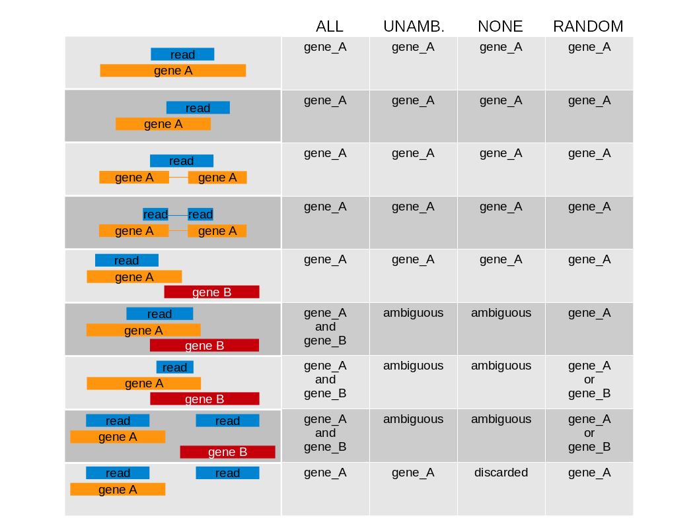
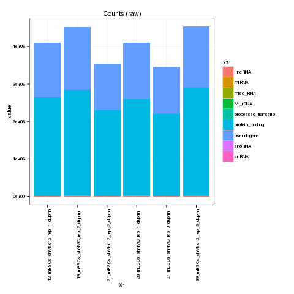
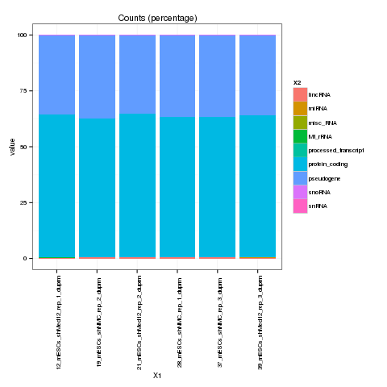

# Requirements #

- R (>3.0.0)
- the parallel package
- GenomicAlignments and rtracklayer from Bioconductor
- A good annotation in GTF format (human & mouse → gencodegenes.org)

# Call the program #

<pre>
$ Rscript ${TOOL_DEPENDENCIES}/imb-forge/RNAtypes/RNAtypes.R folder=${PROJECT}/mapped \
  gtf=/fsimb/groups/imb-bioinfocf/common-data/annotation/mm9/gencode.vM1.annotation.gtf.gz
</pre>

# Program parameters (and defaults) #

<pre>
folder=./           : input folder
pattern="\\.bam$"   : analyze only files matching this pattern (valid R regular expression)
gtf=gencode.gtf     : gtf annotation file. Can be a compressed file
out=RNAtypes        : output filename
pre=" "             : prefix to be removed from sample name (for plotting)
suf="\\.bam"        : suffix to be removed from sample name (for plotting)
paired=no           : no|yes
stranded=no         : no|yes|reverse
multimap=NONE       : multimappers (loci and feature): ALL|UNAMBIGUOUS|NONE|RANDOM
ftype=exon          : feature type on the GTF file to count on (exon|gene|...)
ftypecol=gene_type  : column name in the GTF file containing the biotype info
cores=1             : number of cores to use
</pre>

# Modes #

# Output #

The total number of tag counts per feature described in the GTF file:

The percentage of tags falling in each feature described in the GTF file:

Also the number reported in the plots are stored as a csv table

# More info #

<pre>
$ Rscript ${TOOL_DEPENDENCIES}/imb-forge/RNAtypes/RNAtypes.R --help
</pre>
